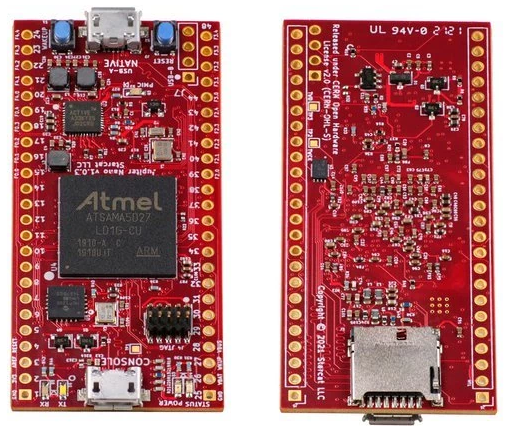
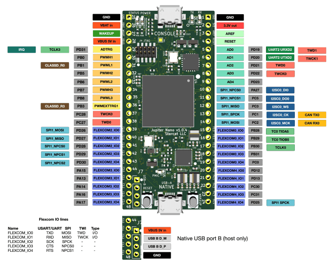

# meta-jupiternano

## Instruction how to build an image for Jupiter Nano in Yocto

### Products:

  
Jupiter Nano Version  
 

Jupiter Nano Pinout  
  

## General Note:
Assumed that Linux Ubuntu is installed

## List of tested elements

Lcd  
Touchscreen  

## List of not tested elements

TBD  

## How to build an images

1. First make sure to following packages are installed in system

    ***sudo apt-get install gawk wget git-core diffstat unzip texinfo gcc-multilib build-essential chrpath socat libsdl1.2-dev xterm emscripten libmpc-dev libgmp3-dev***

    **Note:**
    More informations can be found on Yocto reference manual.

2. Download necessary Yocto packaged listed below. Be sure to be in root of home folder.

	***mkdir yocto*** 
	***cd yocto***  
	***mkdir build***  
	***git clone git://git.yoctoproject.org/poky --depth 1 -b dunfell***  
        ***cd poky***  
	***git clone git://git.openembedded.org/meta-openembedded --depth 1 -b dunfell***  
	***git clone https://github.com/meta-qt5/meta-qt5.git --depth 1 -b dunfell***  
	***git clone git@github.com:voloviq/meta-jupiternano.git --depth 1 -b dunfell***  

3. Select directory to build Linux

    Nano version  
	***source oe-init-build-env ~/yocto/build/jupiternano***  

4. Modify bblayers.conf(located in ~/yocto/build/jupiternano/conf)

    *BBLAYERS ?= " \\\
      ${HOME}/yocto/poky/meta \\\
      ${HOME}/yocto/poky/meta-poky \\\
      ${HOME}/yocto/poky/meta-openembedded/meta-oe \\\
      ${HOME}/yocto/poky/meta-openembedded/meta-networking \\\
      ${HOME}/yocto/poky/meta-openembedded/meta-python \\\
      ${HOME}/yocto/poky/meta-qt5 \\\
      ${HOME}/yocto/poky/meta-jupiternano \\\
      "* 

    **Note:** Please adapt PATH of conf/bblayers.conf if necessary.  

5. Modify local.conf(located in ~/yocto/build/jupiternano/conf) file

    - modify line with "MACHINE ??" to add "jupiter-nano"

    - align *DL_DIR = "${HOME}/yocto/downloads"*  

    - align *SSTATE_DIR = "${HOME}/yocto/sstate-cache"*  
    
    - align *TMPDIR = "${HOME}/yocto/tmp"*  
    
    - add at the end following records    
    	*RM_OLD_IMAGE = "1"*  
	*INHERIT += "rm_work"*  

    **Note:** Please adapt rest of conf/local.conf parameters if necessary.  

6. Build objects

    - console image  
      ***bitbake console-image***  

    - qt5 image  
      ***bitbake qt5-image***  

    - qt5 toolchain sdk  
      ***bitbake meta-toolchain-qt5***  

7. After compilation images appears in

    Nano version  
	*~/yocto/tmp/deploy/images/jupiternano*  

8. Insert SD CARD into dedicated CARD slot and issue following command to write an image

    **Note:**  
    Be 100% sure to provide a valid device name (**of=/dev/sde/mmcblk0**). Wrong name "/dev/sde/mmcblk0" dameage Your system file !    
        Nano version  
    	***sudo dd if=~/yocto/tmp/deploy/images/jupiternano/qt5-image-jupiter-nano.wic of=/dev/mmcblk0 bs=1024***  

# Limitation

	- rootfs-resize not working (SD CARD size can be resized manualy)
	
# Notice
    Based on sama5d27-wlsom1-ek-sd model from
    https://github.com/linux4sam/meta-atmel
